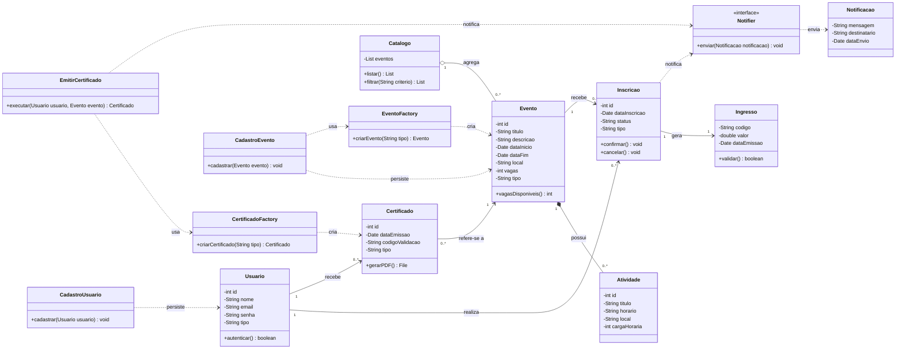

# Diagrama de Classes - Classes Principais

```mermaid
classDiagram
direction LR

class Usuario {
    -int id
    -String nome
    -String email
    -String senha
    -String tipo
    +autenticar() boolean
}

class Evento {
    -int id
    -String titulo
    -String descricao
    -Date dataInicio
    -Date dataFim
    -String local
    -int vagas
    -String tipo
    +vagasDisponiveis() int
}

class EventoFactory {
    +criarEvento(String tipo) Evento
}

class Atividade {
    -int id
    -String titulo
    -String horario
    -String local
    -int cargaHoraria
}

class Inscricao {
    -int id
    -Date dataInscricao
    -String status
    -String tipo
    +confirmar() void
    +cancelar() void
}

class Ingresso {
    -String codigo
    -double valor
    -Date dataEmissao
    +validar() boolean
}

class Catalogo {
    -List eventos
    +listar() List
    +filtrar(String criterio) List
}

class CadastroUsuario {
    +cadastrar(Usuario usuario) void
}

class CadastroEvento {
    +cadastrar(Evento evento) void
}

class Notificacao {
    -String mensagem
    -String destinatario
    -Date dataEnvio
}

class Notifier {
    <<interface>>
    +enviar(Notificacao notificacao) void
}

class Certificado {
    -int id
    -Date dataEmissao
    -String codigoValidacao
    -String tipo
    +gerarPDF() File
}

class CertificadoFactory {
    +criarCertificado(String tipo) Certificado
}

class EmitirCertificado {
    +executar(Usuario usuario, Evento evento) Certificado
}

%% Eventos
EventoFactory ..> Evento : cria
Evento "1" *-- "0..*" Atividade : possui
Catalogo "1" o-- "0..*" Evento : agrega

%% Inscrições
Usuario "1" --> "0..*" Inscricao : realiza
Evento "1" --> "0..*" Inscricao : recebe
Inscricao "1" --> "1" Ingresso : gera

%% Cadastros
CadastroUsuario ..> Usuario : persiste
CadastroEvento ..> Evento : persiste
CadastroEvento ..> EventoFactory : usa

%% Notificações
Notifier ..> Notificacao : envia
Inscricao ..> Notifier : notifica

%% Certificados
Usuario "1" --> "0..*" Certificado : recebe
Certificado "0..*" --> "1" Evento : refere-se a
EmitirCertificado ..> CertificadoFactory : usa
CertificadoFactory ..> Certificado : cria
EmitirCertificado ..> Notifier : notifica
```